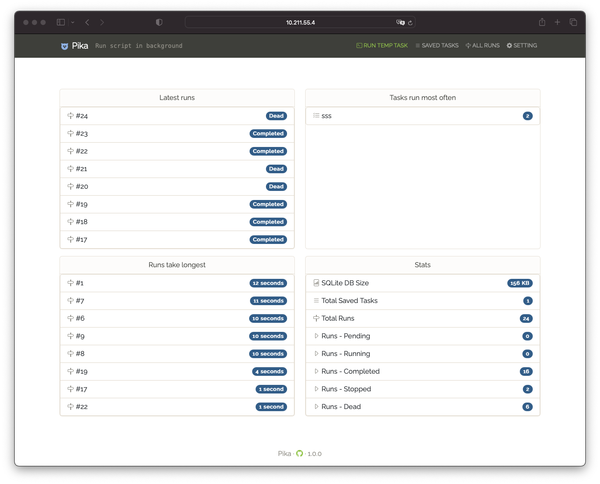
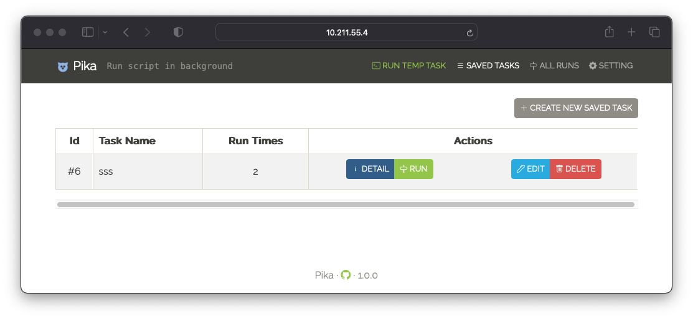
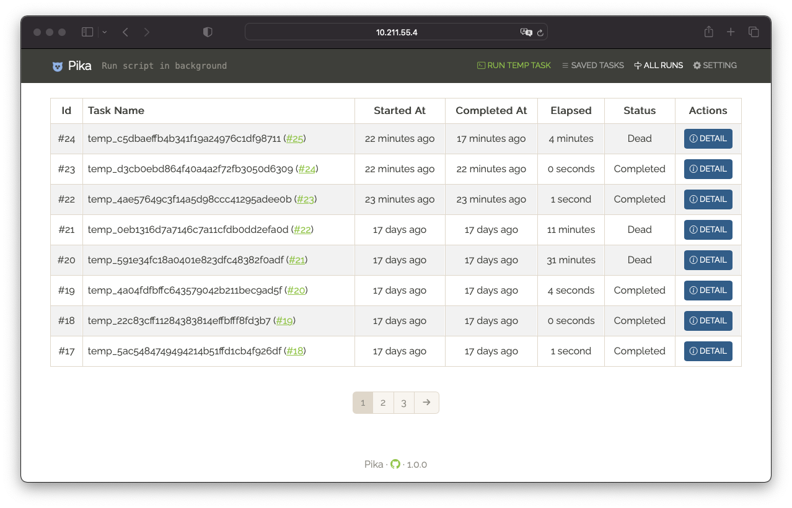
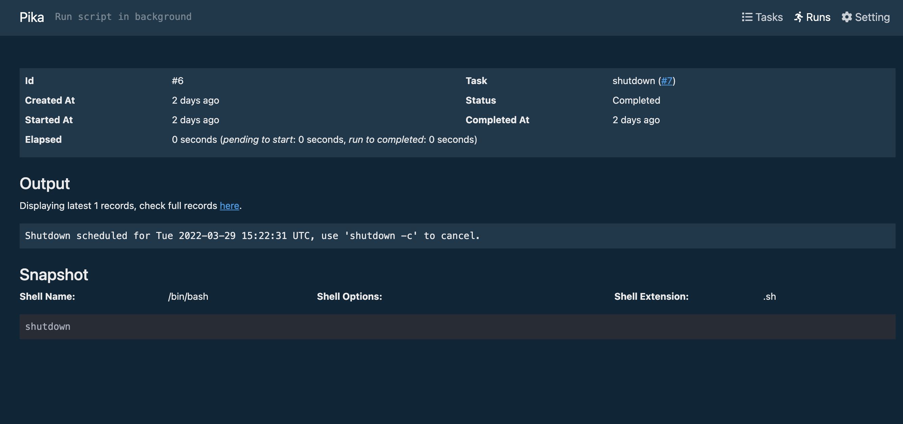

# Pika

[](https://github.com/JerryBian/pika/actions/workflows/build.yml)
[](https://www.gnu.org/licenses/gpl-3.0)
[](https://dotnet.microsoft.com/)

> **A modern web application for running scripts, managing applications, and monitoring drive health in the background.**

Pika is a self-hosted web application that allows you to execute and monitor scripts, manage system applications, and track drive health through an intuitive web interface. Built with ASP.NET Core, it provides real-time updates via SignalR and stores data in a lightweight SQLite database.

## ✨ Features

- 🚀 **Script Execution**: Run shell scripts in the background and monitor their execution in real-time
- 📊 **Real-time Monitoring**: Live updates of script execution status and output via WebSocket (SignalR)
- 💾 **Script Management**: Save, edit, and organize your frequently used scripts
- 🖥️ **Application Management**: Track and manage system applications
- 💿 **Drive Health Monitoring**: Monitor drive health status using smartctl integration
- 🔐 **Authentication**: Secure access with cookie-based authentication
- 🌐 **Cross-platform**: Runs on Linux, macOS, and Windows
- 📦 **Self-contained**: Single executable file with no external dependencies
- 🗄️ **SQLite Database**: Lightweight database with automatic schema initialization

## 📋 Requirements

- **Operating System**: Linux, macOS, or Windows
- **Architecture**: x64, ARM, or ARM64
- **.NET**: Not required (self-contained executable includes .NET 10.0 runtime)

## 📥 Installation

### Download

Go to the [latest release page](https://github.com/JerryBian/pika/releases/tag/latest) and download the binary for your platform:

- **Linux**: `pika-linux-x64.tar.gz`, `pika-linux-arm64.tar.gz`, `pika-linux-arm.tar.gz`, or `pika-linux-musl-x64.tar.gz`
- **Windows**: `pika-win-x64.zip`, `pika-win-x86.zip`, or `pika-win-arm64.zip`
- **macOS**: `pika-osx-x64.tar.gz`

### Linux / macOS

```bash
# Extract the archive
tar -xzf pika-linux-x64.tar.gz

# Make it executable (if needed)
chmod +x pika

# Set required environment variable
export DbLocation=/path/to/data

# Optional: Set the bind URL (default: http://localhost:5000)
export ASPNETCORE_URLS=http://0.0.0.0:8080

# Run Pika
./pika
```

### Windows

```powershell
# Extract the archive
Expand-Archive pika-win-x64.zip -DestinationPath pika

# Navigate to the directory
cd pika

# Set required environment variable
$env:DbLocation="C:\path\to\data"

# Optional: Set the bind URL
$env:ASPNETCORE_URLS="http://localhost:8080"

# Run Pika
.\pika.exe
```

### Running as a System Service

#### Linux (systemd)

Create a systemd service file at `/etc/systemd/system/pika.service`:

```ini
[Unit]
Description=Pika - Web-based Script and Application Manager
After=network.target

[Service]
Type=notify
User=pika
Group=pika
WorkingDirectory=/opt/pika
Environment="ASPNETCORE_URLS=http://127.0.0.1:8080"
Environment="ASPNETCORE_ENVIRONMENT=Production"
Environment="DbLocation=/var/lib/pika/data"
ExecStart=/opt/pika/pika
Restart=on-failure
RestartSec=5s
KillMode=mixed
KillSignal=SIGINT
TimeoutStopSec=30s

[Install]
WantedBy=multi-user.target
```

Then enable and start the service:

```bash
# Create a dedicated user (recommended)
sudo useradd -r -s /bin/false pika
sudo mkdir -p /var/lib/pika/data
sudo chown -R pika:pika /var/lib/pika

# Enable and start the service
sudo systemctl daemon-reload
sudo systemctl enable pika
sudo systemctl start pika

# Check status
sudo systemctl status pika
```

#### Windows (Windows Service)

You can use tools like [NSSM (Non-Sucking Service Manager)](https://nssm.cc/) to run Pika as a Windows service.

## ⚙️ Configuration

Pika is configured via environment variables:

### Required Configuration

| Variable | Description | Example |
|----------|-------------|---------|
| `DbLocation` | Directory path for SQLite database storage. Pika will automatically create the database if it doesn't exist. | `/var/lib/pika/data` or `C:\pika\data` |

### Optional Configuration

| Variable | Description | Default |
|----------|-------------|---------|
| `ASPNETCORE_URLS` | URL(s) the application will listen on | `http://localhost:5000` |
| `ASPNETCORE_ENVIRONMENT` | Application environment (Development/Production) | `Production` |
| `AdminUserName` | Default admin username | `test` |
| `AdminPassword` | Default admin password | `testtest` |

### Configuration Examples

**Linux/macOS:**
```bash
export DbLocation=/var/lib/pika/data
export ASPNETCORE_URLS=http://0.0.0.0:8080
export AdminUserName=admin
export AdminPassword=secure_password
./pika
```

**Windows:**
```powershell
$env:DbLocation="C:\pika\data"
$env:ASPNETCORE_URLS="http://localhost:8080"
$env:AdminUserName="admin"
$env:AdminPassword="secure_password"
.\pika.exe
```

## 🚀 Usage

1. **Start Pika** using one of the methods above
2. **Open your browser** and navigate to the configured URL (default: `http://localhost:5000`)
3. **Login** with the admin credentials (default: `test` / `testtest`)
4. **Create and run scripts** from the web interface
5. **Monitor execution** in real-time with live output updates

### First-time Setup

On first launch, Pika will:
- Create the SQLite database at the specified `DbLocation`
- Initialize the database schema
- Set up the default admin user
- Be ready to accept connections

## 🖼️ Screenshots

### Home Dashboard


### Script Management


### Execution History


### Live Execution Details


## 🏗️ Building from Source

### Prerequisites

- [.NET 10.0 SDK](https://dotnet.microsoft.com/download/dotnet/10.0)
- [Node.js](https://nodejs.org/) (for building frontend assets)

### Build Steps

```bash
# Clone the repository
git clone https://github.com/JerryBian/pika.git
cd pika

# Build frontend assets
npm install
npm run build

# Build the application
dotnet build src/Pika.csproj --configuration Release

# Or publish a self-contained executable
dotnet publish src/Pika.csproj \
  -c Release \
  -r linux-x64 \
  --self-contained true \
  -p:PublishSingleFile=true \
  -o ./publish
```

## 🛠️ Technology Stack

- **Backend**: ASP.NET Core 10.0
- **Frontend**: Bootstrap 5, Bootstrap Icons, Chart.js
- **Real-time Communication**: SignalR
- **Database**: SQLite with Dapper ORM
- **Authentication**: Cookie-based authentication
- **Build Tools**: PowerShell, npm, sass, uglify

## 📝 Development

This project is under active development. Check the [release notes](https://github.com/JerryBian/pika/releases) for updates and new features.

## 🤝 Contributing

Contributions are welcome! Please feel free to submit a Pull Request.

## 📄 License

This project is licensed under the GNU General Public License v3.0 - see the [LICENSE](LICENSE) file for details.

## 🔗 Links

- [GitHub Repository](https://github.com/JerryBian/pika)
- [Release Notes](https://github.com/JerryBian/pika/releases)
- [Report Issues](https://github.com/JerryBian/pika/issues)

---

**Made with ❤️ by [JerryBian](https://github.com/JerryBian)**