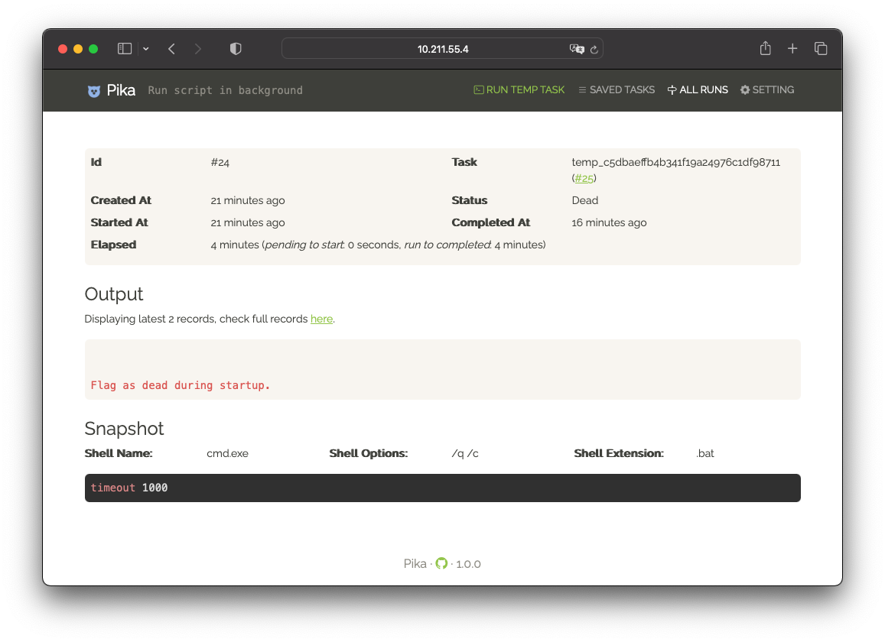

# Pika

[](https://github.com/JerryBian/pika/actions/workflows/build.yml)

Run scripts in background via Web.

## Installation

Go to [Release page](https://github.com/JerryBian/pika/releases/tag/latest), download the binary according to your computer architecture. The binary is self contained executable file, make it not depend on any other files in your system.

For systemd dameon,

```
[Unit]
Description=Run scripts in background via Web.
After=network.target

[Service]
User=root
Environment="ASPNETCORE_URLS=http://127.0.0.1:8080"
Environment="ASPNETCORE_ENVIRONMENT=Production"
Environment="DbLocation=/xxx/data/pika"
WorkingDirectory=/xxx/app/
Restart=on-failure
RestartSec=5s
ExecStart=/xxx/app/pika

[Install]
WantedBy=multi-user.target
```

The only required setting is `DbLocation`, it indicates the location for SQLite db. At the first time, Pika will automatically create it if not exist.

## Misc

This project is under active development, you can peek the [CHANGELOG](https://github.com/JerryBian/pika/blob/master/CHANGELOG.md) for each release.

## Screenshots





## License
[GPLv3](https://github.com/JerryBian/pika/blob/master/LICENSE)